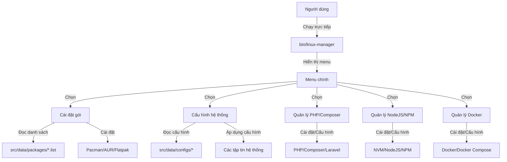

# Linux Manager

Linux Manager là công cụ quản lý hệ thống Linux mạnh mẽ giúp tự động hóa các tác vụ cài đặt, cấu hình và quản lý hệ thống. Script này đặc biệt hữu ích khi cài đặt hệ điều hành mới, giúp bạn thiết lập môi trường làm việc nhanh chóng và hiệu quả.

## Tính năng chính

- Tự động cài đặt các gói phần mềm thiết yếu (từ kho Pacman và AUR)
- Cấu hình hệ thống theo nhu cầu cá nhân
- Quản lý môi trường phát triển (PHP, Composer, Laravel, NodeJS, Docker)
- Giao diện người dùng dòng lệnh trực quan với các thông báo màu sắc
- Cấu trúc module hóa dễ dàng mở rộng và tùy biến

## Cấu trúc thư mục

```
linux-manager/
├── bin/                 # Scripts khởi chạy chương trình
├── logs/                # Lưu trữ nhật ký hoạt động
├── src/                 # Mã nguồn chính
│   ├── core/            # Các tập tin cốt lõi của ứng dụng
│   ├── data/            # Dữ liệu và cấu hình
│   │   ├── configs/     # Tập tin cấu hình mẫu (bash, fish, vim,...)
│   │   └── packages/    # Danh sách các gói cần cài đặt
│   └── modules/         # Các module chức năng
│       ├── dev/         # Quản lý môi trường phát triển
│       │   ├── docker/  # Module quản lý Docker
│       │   ├── nodejs/  # Module quản lý NodeJS/NPM
│       │   └── php/     # Module quản lý PHP/Composer/Laravel
│       ├── misc/        # Các tiện ích khác
│       ├── packages/    # Quản lý cài đặt gói
│       └── system/      # Quản lý cấu hình hệ thống
├── config.sh            # Cấu hình chung (danh sách gói cài đặt)
├── install.sh           # Script cài đặt (tùy chọn)
├── setup.sh             # Script thiết lập cấu trúc thư mục (tùy chọn)
└── uninstall.sh         # Script gỡ cài đặt (tùy chọn)
```

## Luồng hoạt động của ứng dụng



## Hướng dẫn sử dụng

### Yêu cầu hệ thống

- Hệ điều hành dựa trên Arch Linux (Arch, Manjaro, EndeavourOS, CachyOS,...)
- Bash shell
- Quyền sudo

### Cách 1: Sử dụng trực tiếp (Khuyên dùng)

1. Tải về mã nguồn:

```bash
git clone https://github.com/mttk2004/linux-manager.git
cd linux-manager
```

2. Cấp quyền thực thi cho script:

```bash
chmod +x bin/linux-manager
```

3. Chạy ứng dụng:

```bash
./bin/linux-manager
```

### Cách 2: Sử dụng script cài đặt

Nếu bạn muốn sử dụng script cài đặt để tạo cấu trúc thư mục mới:

```bash
chmod +x install.sh
./install.sh
./bin/linux-manager
```

### Tạo liên kết tượng trưng (tùy chọn)

Để có thể chạy Linux Manager từ bất kỳ đâu:

```bash
sudo ln -s /path/to/linux-manager/bin/linux-manager /usr/local/bin/linux-manager
```

## Tùy chỉnh

### Thêm gói cài đặt

Bạn có thể chỉnh sửa danh sách gói trong các tập tin:
- `src/data/packages/pacman.list` - Gói từ kho chính thức
- `src/data/packages/aur.list` - Gói từ AUR
- `src/data/packages/dev.list` - Gói phát triển
- `src/data/packages/multimedia.list` - Gói đa phương tiện

### Thêm cấu hình riêng

Bạn có thể thêm cấu hình shell, terminal hoặc trình soạn thảo vào thư mục `src/data/configs/`.

### Thêm module mới

Để thêm một module mới:
1. Tạo thư mục mới trong `src/modules/`
2. Tạo tập tin `manager.sh` trong thư mục module
3. Triển khai các hàm cần thiết
4. Cập nhật script chính để tích hợp module mới

## Gỡ cài đặt

Để gỡ cài đặt Linux Manager, chạy:

```bash
./uninstall.sh
```

## Đóng góp

Mọi đóng góp đều được hoan nghênh! Vui lòng tạo pull request hoặc báo cáo lỗi nếu bạn tìm thấy vấn đề.

## Giấy phép

Phần mềm này được phân phối theo giấy phép MIT.
